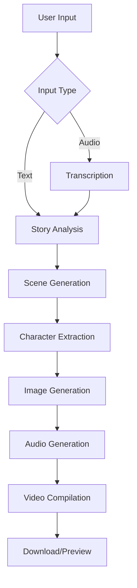

# 🌟 StoryMill - AI-Powered Visual Storytelling Platform

Transform your stories into beautiful animated videos with AI-powered visuals, voice narration, and cinematic transitions.


## ✨ Features

### 🎭 **AI-Powered Story Analysis**
- Intelligent story breakdown into 3-6 cinematic scenes
- Character extraction and consistency tracking
- Mood and context analysis for optimal visuals
- Automatic scene duration and pacing

### 🎨 **Visual Generation**
- Stunning AI-generated illustrations using Gemini Imagen 4
- Character consistency across all scenes
- Natural language image editing with Nano Banana
- Multiple artistic styles and themes

### 🔊 **Audio Production**
- High-quality voice narration with ElevenLabs
- Context-aware ambient sound generation
- Parallel audio processing for faster generation
- Professional audio mixing and balancing

### 🎬 **Video Creation**
- Context-aware transitions based on story mood
- 60fps HD video output (1920x1080)
- Professional cinematic effects
- MP4 format with optimized streaming

### 📱 **Modern Frontend**
- Beautiful, responsive React interface
- Voice recording and file upload support
- Real-time processing progress tracking
- Interactive story preview and editing

## 🚀 Quick Start

### Prerequisites
- Node.js 18+
- FFmpeg (for video generation)
- API Keys for:
  - Google Gemini AI
  - ElevenLabs (optional)
  - Google Cloud Speech (optional)

### 1. Clone Repository
```bash
git clone https://github.com/yourusername/storymill.git
cd storymill
```

### 2. Quick Installation (Recommended)
```bash
# Install all dependencies automatically
node install-dependencies.js
```

**OR Manual Installation:**

### 3. Setup Backend
```bash
cd backend
npm install

# Install the latest Google GenAI package
npm install @google/genai@latest

# Create environment file
cp .env.example .env
# Add your API keys to .env

# Test image generation
npm run test-images

# Start backend server
npm run dev
```

### 4. Setup Frontend
```bash
cd frontend
npm install

# Start frontend development server
npm run dev
```

### 5. Open Application
- Frontend: http://localhost:5173
- Backend API: http://localhost:3001
- Health Check: http://localhost:3001/api/health

## 🏗️ Architecture

### Backend (Node.js + Express)
```
backend/
├── services/
│   ├── geminiService.js      # AI story analysis & image generation
│   ├── audioService.js       # Voice synthesis & transcription
│   ├── imageService.js       # Image generation & editing
│   └── videoService.js       # Video compilation & rendering
├── routes/
│   ├── story.js             # Main story generation endpoints
│   └── video.js             # Video download & streaming
├── utils/
│   ├── validation.js        # Input & output validation
│   ├── apiHelpers.js        # Utility functions
│   └── demoStories.js       # Sample stories for testing
└── server.js                # Express server setup
```

### Frontend (React + Vite)
```
frontend/
├── src/
│   ├── components/
│   │   ├── Navbar.jsx       # Navigation component
│   │   ├── Footer.jsx       # Footer component
│   │   ├── ProcessingSteps.jsx  # Progress tracking
│   │   └── StoryPreview.jsx     # Story viewing
│   ├── pages/
│   │   ├── HomePage.jsx     # Landing page
│   │   ├── CreateStoryPage.jsx  # Story creation
│   │   ├── ViewStoryPage.jsx    # Story viewing
│   │   └── AboutPage.jsx    # About page
│   ├── services/
│   │   └── api.js          # API integration
│   └── App.jsx             # Main app component
└── package.json
```

## 🔧 Configuration

### Backend Environment Variables
```env
# Required - Core AI Services
GEMINI_API_KEY=your_gemini_api_key

# Cost-Optimized Audio (Primary: Google Cloud, Fallback: ElevenLabs)
GOOGLE_CLOUD_API_KEY=your_google_cloud_api_key
ELEVENLABS_API_KEY=your_elevenlabs_api_key

# Server Configuration
PORT=3001
NODE_ENV=development
FRONTEND_URL=http://localhost:5173
```

### 🎯 Optimized Service Strategy
- **Text-to-Speech**: Google Cloud primary (cost-effective), ElevenLabs fallback
- **Speech-to-Text**: ElevenLabs primary (superior accuracy), Google Cloud fallback  
- **Image Generation**: Gemini Imagen 4 (premium quality justified)
- **Ambient Sounds**: ElevenLabs optimized settings (premium feature)

### Frontend Environment Variables
```env
VITE_API_URL=http://localhost:3001/api
VITE_APP_NAME=StoryMill
VITE_APP_VERSION=1.0.0
```

## 🎯 API Endpoints

### Story Generation
- `POST /api/story/generate-complete` - Generate complete story from text/audio
- `POST /api/story/analyze` - Analyze story text only
- `GET /api/story/demo` - Generate demo story
- `GET /api/story/status` - Backend status

### Video Management
- `GET /api/video/download/:id` - Download generated video
- `GET /api/video/stream/:id` - Stream video for preview

### System Monitoring
- `GET /api/health` - Basic health check
- `GET /api/system/status` - Detailed system information
- `GET /api/system/metrics` - Performance metrics

## 🎨 Story Generation Flow



## 🎭 Context-Aware Features

### Smart Transitions
- **Horror/Scary** → `fadeblack` (1.2s) - Ominous fade through black
- **Action/Exciting** → `wipeleft/slideright` (0.3-0.4s) - Dynamic transitions
- **Magical** → `circlecrop` (1.0s) - Mystical circle reveal
- **Day→Night** → `fadeblack` (1.5s) - Natural lighting transition
- **Emotional Changes** → Context-appropriate slide directions

### Ambient Sound Generation
- **Horror**: Eerie whispers, creaking, haunting atmosphere
- **Action**: Dramatic tension, footsteps, adventure sounds
- **Magical**: Sparkles, mystical chimes, enchanted ambience
- **Nature**: Birds chirping, wind, forest sounds
- **Urban**: Traffic, crowds, city ambience

## 📊 Performance Metrics

### Processing Times
- **Story Analysis**: 10-30 seconds
- **Image Generation**: 1-2 minutes per scene
- **Audio Generation**: 30-60 seconds (parallel processing)
- **Video Compilation**: 1-2 minutes
- **Total Average**: 2-4 minutes per complete story

### Output Quality
- **Video**: 1920x1080 @ 60fps MP4
- **Audio**: 128kbps AAC with ambient mixing
- **Images**: High-resolution AI-generated artwork
- **File Size**: 50-200MB depending on story length

### 💰 Cost Breakdown (Per Story)
- **Google Cloud TTS**: ~$0.02 per story (1000 characters avg)
- **ElevenLabs STT**: ~$0.05 per minute of audio (superior accuracy)
- **Gemini Imagen 4**: ~$0.20 per image (4-6 images per story)
- **ElevenLabs Sound**: ~$0.10 per ambient sound (optional)
- **Total Estimated Cost**: $0.85-1.60 per complete story

## 🧪 Testing

### Backend Testing
```bash
cd backend
npm test
```

### Frontend Testing
```bash
cd frontend
npm test
```

### API Testing
```bash
# Health check
curl http://localhost:3001/api/health

# Generate demo story
curl http://localhost:3001/api/story/demo
```

## 🚀 Deployment

### Docker Deployment
```bash
# Build and run with Docker Compose
docker-compose up --build

# Or build individually
docker build -t storymill-backend ./backend
docker build -t storymill-frontend ./frontend
```

### Production Deployment
```bash
# Backend
cd backend
npm run build
npm start

# Frontend
cd frontend
npm run build
npm run preview
```

### Environment Setup
1. Set up production API keys
2. Configure CORS for your domain
3. Set up SSL certificates
4. Configure CDN for static assets
5. Set up monitoring and logging

## 🔍 Monitoring & Analytics

### Health Monitoring
- Real-time system status at `/api/health`
- Performance metrics at `/api/system/metrics`
- Memory usage and uptime tracking
- API response time monitoring

### User Analytics
- Story generation success rates
- Processing time analytics
- User engagement metrics
- Error tracking and reporting

## 🤝 Contributing

### Development Setup
1. Fork the repository
2. Create a feature branch
3. Set up development environment
4. Make your changes
5. Add tests for new features
6. Submit a pull request

### Code Standards
- ESLint configuration for JavaScript
- Prettier for code formatting
- Conventional commits for git messages
- JSDoc comments for functions
- Comprehensive error handling

## 📚 Documentation

### API Documentation
- OpenAPI/Swagger specification
- Postman collection available
- Interactive API explorer
- Code examples in multiple languages

### User Guides
- Getting started tutorial
- Story creation best practices
- Troubleshooting guide
- FAQ and common issues

## 🔒 Security

### API Security
- Input validation and sanitization
- Rate limiting on all endpoints
- CORS configuration
- API key validation
- Request size limits

### Data Privacy
- No permanent story storage
- Temporary file cleanup (1 hour)
- No user data collection
- GDPR compliant processing

## 🐛 Troubleshooting

### ❌ "Request failed with status code 404"

**Quick Fix:**
```bash
# 1. Check if backend is running
cd backend && npm run test-connection

# 2. Start backend if not running
npm run dev

# 3. Verify frontend API URL
cat frontend/.env  # Should show: VITE_API_URL=http://localhost:3001/api
```

### ❌ "Generation Failed" - API Key Issues

**Quick Fix:**
```bash
# 1. Test API keys
cd backend && npm run test-services

# 2. Configure API keys in backend/.env
GEMINI_API_KEY=your_actual_key
GOOGLE_CLOUD_API_KEY=your_actual_key  
ELEVENLABS_API_KEY=your_actual_key
```

### 🔧 Complete Troubleshooting

For detailed troubleshooting, see [TROUBLESHOOTING.md](TROUBLESHOOTING.md)

**Quick Start Test:**
```bash
# Test everything at once
node start-storymill.js
```

### Getting Help
- 📖 Read [TROUBLESHOOTING.md](TROUBLESHOOTING.md) for detailed solutions
- 🐛 Check [Issues](https://github.com/yourusername/storymill/issues) page
- 💬 Join our [Discord Community](https://discord.gg/storymill)
- 📧 Email support: support@storymill.ai

## 📄 License

MIT License - see [LICENSE](LICENSE) file for details.

## 🙏 Acknowledgments

- **Google Gemini AI** - Story analysis and image generation
- **ElevenLabs** - Voice synthesis and audio generation
- **FFmpeg** - Video processing and compilation
- **React Community** - Frontend framework and ecosystem
- **Open Source Contributors** - Various libraries and tools

## 🌟 Roadmap

### Version 1.1
- [ ] User accounts and story saving
- [ ] Story templates and themes
- [ ] Batch story processing
- [ ] Advanced video editing

### Version 1.2
- [ ] Multi-language support
- [ ] Collaborative story editing
- [ ] Story sharing platform
- [ ] Mobile app development

### Version 2.0
- [ ] Real-time collaboration
- [ ] Advanced AI models
- [ ] 3D scene generation
- [ ] VR/AR story experiences

---

**Made with ❤️ by the StoryMill Team**

Transform your imagination into cinematic reality with StoryMill! 🎬✨